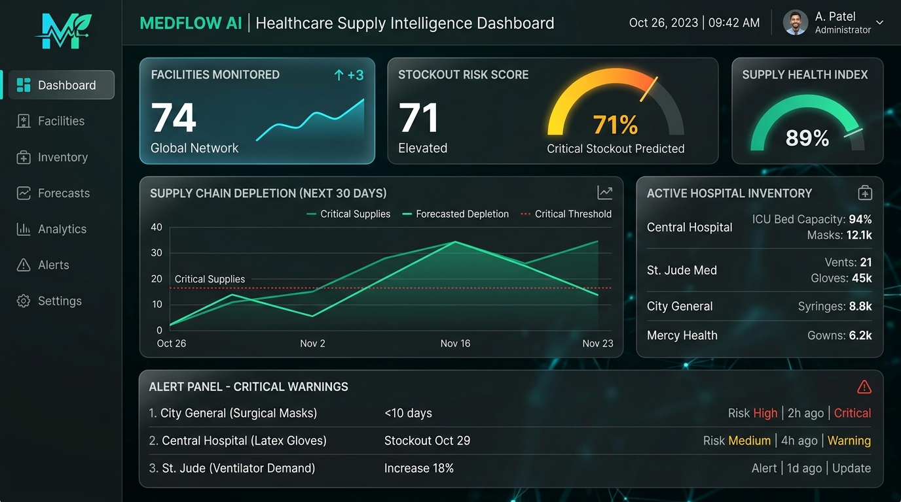
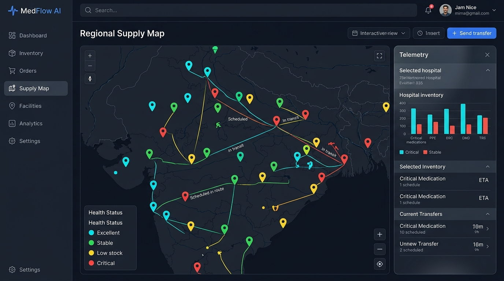
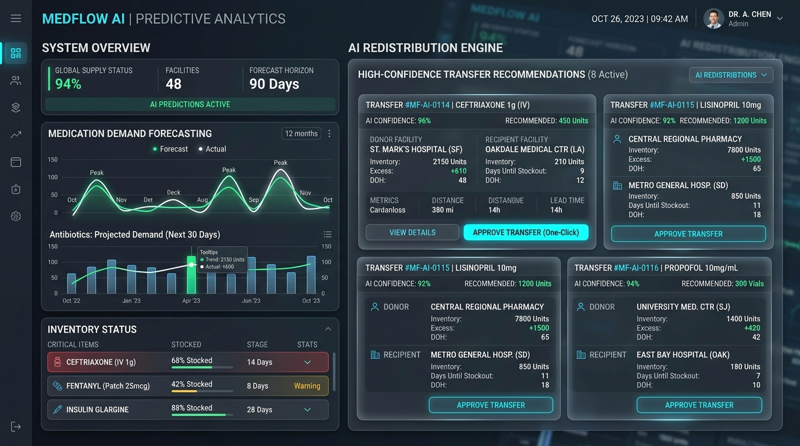
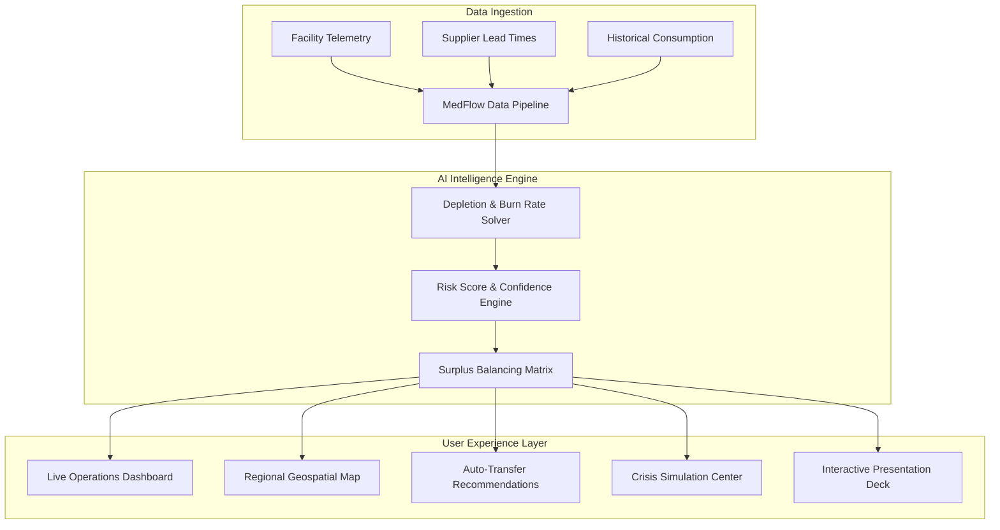

# 🏥 MedFlow AI — Healthcare Supply Intelligence & Autonomous Stockout Mitigation

<div align="center">


[](https://shrex88.github.io/MedFlow)
[](https://www.typescriptlang.org/)
[](https://react.dev/)
[](https://vitejs.dev/)
[](LICENSE)

**An AI-driven, real-time regional medical inventory intelligence system designed to predict medicine shortages, optimize multi-facility redistribution, and prevent critical stockouts.**

[🚀 Explore Live Demo Deck](https://shrex88.github.io/MedFlow) • [📽️ Open Slide Deck (PRESENTATION.md)](PRESENTATION.md) • [📖 Documentation](#-system-architecture) • [🧪 Crisis Simulator](#-epidemic--crisis-simulation-center)

</div>

---

## 🌟 Executive Overview

In regional healthcare systems, **medicine stockouts cost lives**. Rural clinics and regional hospitals often suffer sudden shortages of essential drugs (Insulin, Epinephrine, Antibiotics, Vaccines) while nearby medical centers hold excess inventory that expires unused. 

**MedFlow AI** bridges this gap by unifying regional health facility data into a real-time predictive command platform. Powered by dynamic depletion forecasting and autonomous logistics balancing, MedFlow shifts healthcare supply management from **reactive manual ordering** to **proactive automated redistribution**.

```
                       ┌─────────────────────────────────────┐
                       │     MedFlow AI Command Platform     │
                       └──────────────────┬──────────────────┘
                                          │
         ┌────────────────────────────────┼────────────────────────────────┐
         │                                │                                │
 ┌───────▼───────┐                ┌───────▼───────┐                ┌───────▼───────┐
 │ Predictive AI │                │ Inter-Hospital│                │   Geospatial  │
 │ Stockout Engine│                │ Redistribution│                │  Supply Map   │
 └───────────────┘                └───────────────┘                └───────────────┘
```

---

## 📸 Interface Showcase

<div align="center">

### 📊 Command Operations Dashboard


<br/>

### 🗺️ Regional Geospatial Supply Map


<br/>

### 🤖 Predictive Analytics & AI Redistribution Engine


</div>

---

## 🔥 Key Features

### 📊 1. Command Operations Dashboard
- **Real-Time Telemetry**: Instant overview of system KPIs, total regional inventory health, critical risk alerts, and operational trends.
- **Risk Spectrum Categorization**: Automatic classification into `Healthy` (>14 days), `Warning` (7-14 days), and `Critical` (<7 days) statuses.

### 🤖 2. AI Stockout Prediction Engine
- **Moving Average Depletion Math**: Dynamic forecasting using trailing 7-day consumption rates, local burn acceleration, and supplier lead times.
- **Confidence Scoring**: High-precision confidence indices (85% to 98%) attached to every prediction node.

### ⚡ 3. Autonomous Inter-Hospital Redistribution
- **Surplus-to-Shortage Matching**: Identifies over-stocked facilities (donors) and pairs them with high-risk clinics (recipients).
- **Distance & Travel Optimization**: Evaluates distance in kilometers and transit duration in hours to calculate optimal delivery routes.
- **Risk Delta Calculation**: Pre-calculates regional risk reduction before confirming any transfer.

### 🗺️ 4. Regional Geospatial Supply Map
- **Interactive Leaflet Map**: Visualizes hospital locations, real-time risk markers, and inter-facility transfer corridors.
- **GPS Coordinates**: Accurate mapping across regional health networks with custom telemetry popups.

### 🧪 5. Epidemic & Crisis Simulation Center
- **Outbreak Spikes**: Stress-test regional supply networks by injecting +100% to +300% disease surge consumption.
- **Supplier Shock**: Simulate supply chain bottlenecks (3 to 14 days delay) and evaluate network resilience.
- **Live Re-balancing Engine**: Watch the platform autonomously calculate emergency transfers to absorb the crisis.

### 📽️ 6. In-App Interactive Presentation Deck
- **Built-in Slide Deck**: Launch an 8-slide presentation pitch deck directly inside the application.
- **Presenter Features**: Keyboard arrow navigation, auto-advance slideshow timer, fullscreen toggle, and quick feature jumps.

---

## 🏗️ System Architecture

MedFlow AI operates as a multi-tier reactive intelligence architecture:



---

## 🛠️ Technology Stack

| Domain | Technology | Description |
| :--- | :--- | :--- |
| **Frontend Framework** | `React 18` + `TypeScript 5.7` | Type-safe, component-driven UI architecture |
| **Build System** | `Vite 6` | Fast HMR dev server and optimized ESM production bundler |
| **Styling & UI** | `Tailwind CSS 3.4` + `Lucide Icons` | Modern dark glassmorphism design system & icon library |
| **Geospatial Mapping** | `Leaflet` + `React-Leaflet` | Interactive vector maps and customized map markers |
| **Data Analytics** | `Recharts 2.15` | Interactive time-series trends and consumption analytics |
| **API & Backend** | `Express 4` + `tsx` | Lightweight Node.js API pipeline for remote sync |
| **Deployment** | `GitHub Pages` + `gh-pages` | Static site hosting with automated asset routing |

---

## 🚀 Quick Start Guide

### Prerequisites
- Node.js `v18.0.0` or higher
- npm `v9.0.0` or higher

### 1. Clone Repository
```bash
git clone https://github.com/shrex88/MedFlow.git
cd MedFlow
```

### 2. Install Dependencies
```bash
npm install
```

### 3. Run Development Server
```bash
npm run dev
```
- Open [http://localhost:5173](http://localhost:5173) in your browser.
- The app runs in concurrent client and mock backend mode.

### 4. Build for Production
```bash
npm run build
```

---

## 📦 GitHub Pages Deployment

MedFlow AI is configured for one-command deployment to **GitHub Pages**:

```bash
npm run deploy
```

This command runs `predeploy` (`tsc && vite build`) and pushes the output `dist` folder directly to the `gh-pages` branch.

Live deployment URL: [https://shrex88.github.io/MedFlow](https://shrex88.github.io/MedFlow)

---

## 📂 Project Structure

```
MedFlow/
├── .github/              # GitHub Actions workflows & static deploy configs
├── public/               # Static assets & .nojekyll configuration
├── server/               # Express API backend server scripts
├── src/
│   ├── components/       # Reusable layout components (Header, Sidebar)
│   ├── context/          # MedFlowContext (Global state & AI engine logic)
│   ├── data/             # Initial facility telemetry & inventory mock data
│   ├── pages/            # Feature views (Dashboard, Map, Presentation, etc.)
│   ├── services/         # Algorithmic helper modules & API services
│   └── types/            # TypeScript interfaces & type definitions
├── index.html            # Main HTML entry point
├── package.json          # Project scripts and dependencies
├── tailwind.config.js    # Tailwind styling tokens
└── vite.config.ts        # Vite build configuration with GitHub base path
```

---

## 📜 License

Distributed under the **MIT License**. See `LICENSE` for details.

<div align="center">

Made with ❤️ for global healthcare supply chain resilience.

[⭐ Star this repository on GitHub](https://github.com/shrex88/MedFlow)

</div>
